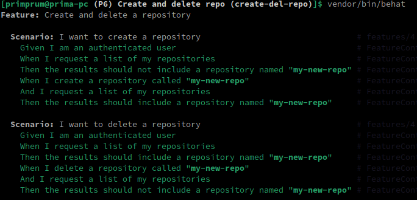

# Create and delete repository from Github API

This project will going to test the functionality of creating and deleting repository from authenticated Github API.

<br>

### What is the purpose of this test?

The purpose of this test project is to verify the functionality of interactions with the GitHub API using Behat.

Specifically, the project aims to validate the following:

- **Authentication** <br> Ensure that users can authenticate successfully with their GitHub account using a personal access token.
- **Repository Creation** <br> Verify that repositories can be created successfully through the GitHub API.
- **Repository Deletion** <br> Confirm that repositories can be deleted successfully via the GitHub API.
- **Listing Repositories** <br> Ensure that the list of repositories returned by the GitHub API includes the expected repositories after creation and deletion operations.

By testing these functionalities, this project helps ensure the reliability and correctness of interactions with the GitHub API, which is crucial for applications relying on GitHub integration or automation.

<br>

### The feature consists of two scenarios:

1. Scenario 1: I want to create a repository
2. Scenario 2: I want to delete a repository

<br>

#### Scenario 1: I want to create a repository

```gherkin
Given I am an authenticated user
When I create a repository called "my-new-repo"
And I request a list of my repositories
Then the results should include a repository named "my-new-repo"
```

<br>

#### Scenario 2: I want to delete a repository

```gherkin
Given I am an authenticated user
And I request a list of my repositories
And the results should include a repository named "my-new-repo"
When I delete a repository called "my-new-repo"
And I request a list of my repositories
Then the results should not include a repository named "my-new-repo"
```

This scenario follows the created repository from Scenario 1, but before doing deletion, we need to make sure that the repo we want to delete is exist, and after it has been deleted, we need to assert that the repo has became non-exist.

<br>

### Running the Test

To run this test suite:

- Ensure you have Behat installed and configured.
- Set up your GitHub token in the behat.yml file.
- Run the Behat tests using the command line.

<br>

### Generating the functions

On our project workspace:

```bash
vendor/bin/bash
```

Then we choose to generate the FeatureContext file.

<br>

After that, we'll get the following functions:

```php
/**
 * @Given I am an authenticated user
 */
public function iAmAnAuthenticatedUser()
{
    // stuff
}

/**
 * @When I create a repository called :arg1
 */
public function iCreateARepositoryCalled($arg1)
{
    // stuff
}

/**
 * @When I delete a repository called :arg1
 */
public function iDeleteARepositoryCalled($arg1)
{
    // stuff
}

/**
 * @When I request a list of my repositories
 */
public function iRequestAListOfMyRepositories()
{
    // stuff
}


/**
 * @Then the results should include a repository named :arg1
 */
public function theResultsShouldIncludeARepositoryNamed($arg1)
{
    // stuff
}

/**
 * @Then the results should not include a repository named :arg1
 */
public function theResultsShouldNotIncludeARepositoryNamed($arg1)
{
    // stuff
}
```

<br>

### Managing constructor to authenticate to the API

Inside FeatureContext.php we need to declare the variable as array:

```php
protected $params = [];
```

And then we assign the variable inside the constructor:

```php
public function __construct(array $parameters = [])
{
    $this->params = $parameters;
    $this->client = new \Github\Client();
}
```

<br>

### Given: I am an authenticated user

This generates function `iAmAnAuthenticatedUser()`.

In this case, we're gonna connect into Github API as an authenticated user. So, we do this:

```php
public function iAmAnAuthenticatedUser()
{
    $this->client->authenticate($this->params['github_token'], null, Github\AuthMethod::ACCESS_TOKEN);
}
```

<br>

### When: I create a repository called :arg1

This generates function `iCreateARepositoryCalled($arg1)`.

We could then fill it with this:

```php
public function iCreateARepositoryCalled($arg1)
{
    $this->client->api('repo')->create($arg1,
        'Description of the newly created repository', 'https://www.linkedin.com/in/prima-wirawan/', true);

    $this->checkResponseCode(201);
}
```

Notice that the `checkResponseCode()` has an argument 201 (Created), which means the code expects the response to have a status code of 201 to ensure that the creation was successful.

But before that, we need to create the `checkResponseCode()` function itself:

```php
protected function checkResponseCode($expected)
{
    $statusCode   = $this->client->getLastResponse()->getStatusCode();

    if ($expected != $statusCode) {
        throw new Exception("Expected a $expected status code but got $statusCode instead!");
    }
}
```

<br>

### When: I delete a repository called :arg1

This generates function `iDeleteARepositoryCalled($arg1)`.

We could then fill it with this:

```php
public function iDeleteARepositoryCalled($arg1)
{
    $githubUser = $this->client->api('current_user')->show()['login'];
    $this->client->api('repo')->remove($githubUser, $arg1);

    $this->checkResponseCode(204);
}
```

Notice that the `checkResponseCode()` has an argument 204 (No content), which means that the server successfully processed the request but is not returning any content.

<br>

### When: I request a list of my repositories

This generates function `iRequestAListOfMyRepositories()`.

This function also appear on this `find-repo` test --> https://github.com/primprum/find-repo

The content is more likely the same:

```php
public function iRequestAListOfMyRepositories()
{
    $repositories = $this->client->api('current_user')->repositories();

    $this->checkResponseCode(200);

    $this->results = $repositories;
}
```

Don't forget to declare variable `$results`:

```php
protected $results = null;
```

<br>

### Then: the results should include a repository named :arg1

This generates function `theResultsShouldIncludeARepositoryNamed($arg1)`.

We can fill it like this:

```php
public function theResultsShouldIncludeARepositoryNamed($arg1)
{
    if (!$this->repositoryExists($this->results, $arg1)) {
        throw new Exception("Expected to find a repository called '$arg1' but it doesn't exist.");
    }
}
```

There is `repositoryExists()` function, therefore we need to create it too:

```php
protected function repositoryExists($repoArray, $repoName)
{
    $repositories = array_column($repoArray, 'name', 'name');

    return isset($repositories[$repoName]);
}
```

<br>

### Then: the results should not include a repository named :arg1

This generates function `theResultsShouldNotIncludeARepositoryNamed($arg1)`.

This function is basically the negation of previous function:

```php
public function theResultsShouldNotIncludeARepositoryNamed($arg1)
{
    if ($this->repositoryExists($this->results, $arg1)) {
        throw new Exception("Expected not to find a repository called '$arg1' but it does exist.");
    }
}
```

<br>

### Test result



All scenario has been tested successfully, this means that the basic function for creating and deleting the repo through the API work as expected.

<br>

### Summary

Through this test, we've learned several key aspects:

**Functionality Testing:** <br>
We've verified the functionality of creating and deleting repositories using the GitHub API. This ensures that users can effectively manage their repositories through programmatic interactions with the GitHub platform.

**Authentication Handling:** <br>
The test demonstrates the ability to authenticate users using their GitHub tokens, ensuring secure access to GitHub's API for repository management actions. This authentication mechanism enhances the security of interactions with the GitHub platform.

**Automated Testing:** <br>
By automating these test scenarios with Behat and PHP, we've established a reliable means of continuously testing repository creation and deletion functionality. This automation facilitates early detection of issues and ensures consistent behavior across different environments.

**User Experience Assurance:** <br>
Ensuring that repositories are correctly created and deleted through the API contributes to a positive user experience on GitHub. By verifying these functionalities, we enhance user confidence in the reliability and usability of the platform.

**Platform Reliability:** <br>
Verifying the reliability of critical features like repository creation and deletion is essential for maintaining the overall reliability and trustworthiness of the GitHub platform. Thorough testing of these functionalities contributes to the platform's stability and resilience.

<br>

> Overall, this test underscores the importance of rigorous testing to ensure the functionality, security, and user experience of GitHub's features, ultimately contributing to a seamless and reliable platform for developers and users worldwide.

<br>

### What this test can't do

While this test verifies the basic functionality of creating and deleting repositories through the GitHub API, it does not cover every possible scenario or edge case.

For example, it does not test for potential API rate limiting, network issues, or edge cases related to repository names or descriptions. Additionally, it does not cover advanced repository management features such as branch protection rules, issue tracking, or pull request workflows.

> Users should conduct additional testing and consider these factors when integrating GitHub API functionality into their applications.

**_Overall, this test underscores the importance of rigorous testing to ensure the functionality, security, and user experience of GitHub's features, ultimately contributing to a seamless and reliable platform for developers and users worldwide._**

<br>

### Test demo

[](https://www.youtube.com/embed/spWqi6KYhn8)
